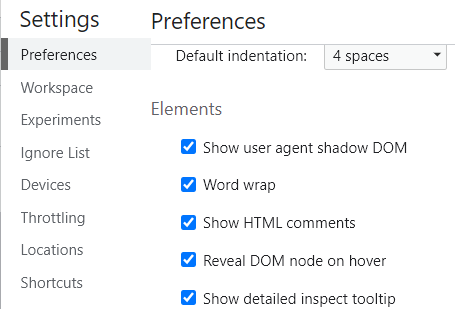

引入 react 组件：

1. 'import' 语句后面必须要有空格，否则组件不会渲染

```javascript
import ScssBase1 from "./scssBase1.tsx"; // 不会渲染ScssBase1
<div>
  <ScssBase1 />
</div>
```

```javascript
import ScssBase1 from "./scssBase1.tsx"; // 可以渲染ScssBase1

<div>
  <ScssBase1 />
</div>
```

2. 组件外面必须包一个标签，并且最外层只能有一个标签

```mdxjs
import ScssBase1 from "./scssBase1.tsx";

<div>
  <ScssBase1 />
</div>
```

本项目中的 react 组件：

### 支持 sass，less

less sass 必须要安装插件才能支持，并且文件名都需要加.module 例如 lightRing.module.scss

安装支持 sass 插件：

```shell
yarn add --save docusaurus-plugin-sass sass
```

安装支持 less 插件：

```shell
yarn add docusaurus-plugin-less
```

配置 docusaurus.config.js 文件

```javascript title="docusaurus.config.js"
export default {
  plugins: ["docusaurus-plugin-sass", "docusaurus-plugin-less"],
};
```

### 编写 mdx 中能用的 react 组件

```tsx title="rectComponent"
import React from "react";
import styles from "./lightRing.module.less";
// import styles from "./lightRing.module.scss";

const RectComponent: React.FC<any> = () => {
  return (
    <div className={styles.lightRing}>
      <span></span>
    </div>
  );
};

export default RectComponent;
```

## markdown 语法

### 提示样式语法（markdown 的语法）

```markdown
:::tip
内容（内部可以嵌套组件）
显示”提示“的文字，和相应图标
:::

:::info
内容
显示”信息“的文字，和相应图标
:::

:::warning
内容
显示”危险“的文字，和相应图标
:::
```

:::tip
内容
:::

:::info
内容
:::

:::warning
内容
:::

:::tip

Use the power of React to create interactive blog posts.

```js
<button onClick={() => alert("button clicked!")}>Click me!</button>
```

<button onClick={() => alert("button clicked!")}>Click me!</button>
:::

### 标签样式组件

用字符串模板的单引号包住标签，不但能够不让mdx意外解析`<`，而且能以标签样式高亮为标签

```mdxjs title="index.mdx"
`我是标签`
```

`我是标签`

## mdx 中的语法

### 关键词在正文中作为文本显示

需要关键词在正文中作为文本显示时，外面需要加单引号，否则不会显示成文本，而是当成关键词执行。

例如：
'import'是什么意思，这里的'import'要用英文单引号包起来，否则不显示，而去执行

:::info
'<!'--truncate--'>' 标签必须前后都用英文单引号 **分别单独** 包起来，否则不显示，而去执行
:::

### 代码块 title

```javascript title="docusaurus.config.js"
// 这个代码块上有title，一般用来表示代码所在文件名
let a = 3;
```

### mdx 中用普通 html 标签的语法

```mdxjs title="index.mdx"
<button onClick={() => alert("button clicked!")}>Click me!</button>
```

<button onClick={() => alert("button clicked!")}>Click me!</button>

### 直接用 mdx 组件的简洁语法

mdx 组件参考文档：

https://www.mdxjs.cn/table-of-components

### 插入图片

直接插入，图片的展示大小和图片实际大小一样：

```mdxjs title="index.mdx"

```


想要控制引入的图片的大小：

```mdxjs title="index.mdx"
import imgSrc from './shadowDom.png'


```

import imgSrc from "./images/shadowDom.png";


### 链接组件

```mdxjs title="index.mdx"
<https://mdxjs.com>
// or
[MDX](https://mdxjs.com)
```

`<https://mdxjs.com>`
// or
[MDX](https://mdxjs.com)

## 博客 mdx 文件

### 博客 mdx 文件配置：

```mdxjs title="blogIndex.mdx"
---
slug: mdx-blog-post
title: MDX Blog Post
authors: [AmosZhang]
tags: [docusaurus]
---
```

### 博客 mdx 文件预览时折叠详情功能：

博客列表中显示'<!'--truncate--'>'标签上面的内容，并且列表里面会多一个

```mdx title="blogIndex.mdx"
This is the summary of a very long blog post,

Use a `<!--` `truncate` `-->` comment to limit blog post size in the list view.

<!--truncate-->

Lorem ipsum dolor sit amet, consectetur adipiscing elit. Pellentesque elementum dignissim ultricies. Fusce rhoncus ipsum tempor eros aliquam consequat. Lorem ipsum dolor sit amet

Lorem ipsum dolor sit amet, consectetur adipiscing elit. Pellentesque elementum dignissim ultricies. Fusce rhoncus ipsum tempor eros aliquam consequat. Lorem ipsum dolor sit amet

Lorem ipsum dolor sit amet, consectetur adipiscing elit. Pellentesque elementum dignissim ultricies. Fusce rhoncus ipsum tempor eros aliquam consequat. Lorem ipsum dolor sit amet
```

### 项目直接显示一级菜单，不要嵌套

删除*category*.json 中的 link
