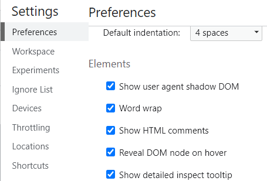

### calc

```css
.a {
  width: calc(100% - 50px);
}
.a {
  width: calc (100% - 50px); // calc和'('之间一定不能加空格,加了浏览器不认！
}
```

### 多张背景图

background 支持多张背景图，逗号隔开

```css
.backgroundBox {
  height: 200px;
  background: url("./1.jpg") no-repeat 0 0, url("./2.jpg") no-repeat 200px 0,
    url("./3.jpg") no-repeat 600px 0;
}
```

### 选择器

正则选择器

```css
div[id*="demo"] {
  /*id包含demo的div，注意，demo要加引号*/
  font-size: 30px;
}

div[herf^="http"] {
  /* herf以http开头的div*/
  color: red;
}

div[herf$=".pdf"] {
  /* herf属性以.pdf结尾的div*/
  color: blue;
}
```

### z-index

有时候发现 A 元素提高 z-index 无论怎么往大设置都覆盖不了 z-index 低的 B 元素，因为 A 元素有一个父元素的 z-index 比较低，需要增加父元素的 z-index

### flex 指定撑满剩余 指定宽度

flex 容器的子元素如果没有指定宽度，子元元素会被孙子等元素的内容撑开。
发生 flex 容器宽度变小了，但是子元素宽度莫名其妙不缩小的问题（其实是被孙子元素的内容撑开了）。

子元素加上 overflow:hidden。可解决（好一些）。

或者设定子元素的宽度 100%或者 calc(100% - 100px)等都可以。（实际效果是 flex 弹性布局和设定宽度的结合，规则比较复杂，用到实际看）

用 flex 实现几列等分，如 3 等分

```scss
.box {
  display: flex;
  .panel {
    flex: 0 0 33.3333%;
  }
}
```

### flex 指定撑满剩余  溢出
有些情况下会因为内部其他元素撑开“用于撑满剩余尺寸的元素”，使之超出flex外壳main的尺寸。需要加overflow: hidden
```less
.main {
  display: flex;
  .submenu {
    flex: 0 0 160px;
  }
  .contentRight {
    flex-grow: 1;
    overflow: hidden; // 有些情况下会因为内部其他元素撑开“用于撑满剩余尺寸的元素”，使之超出flex外壳main的尺寸。需要加overflow: hidden
  }
}
```

### sticky 吸顶

小于设定高度，小于此高度不在上移，吸顶效果

```css
.title {
  position: sticky;
  top: 50px;
}
```

### 控制台查看 影子元素

-webkit-input-placeholder 影子元素浏览器查看不到

需要在控制台勾选 Show user agent shadow DOM



```css
input::-webkit-input-placeholder,
textarea::-webkit-input-placeholder {
  color: yellow;
}
```

### placeholder 字体和颜色，placeholder 在 disabled 状态下的字体和颜色

```vue
<el-form>
    <el-select
      v-model="formDate.twoStageMarket"
      :filterable="true"
      :disabled="!isEdit"
      placeholder="请选择"
      clearable
      class="test"
    >
      <el-option
        v-for="(item, index) in twoStageMarketOption"
        :key="index"
        :label="item.label"
        :value="item.value"
      />
    </el-select>
</el-form>

<style lang="scss" scoped>
:deep(.selfInput) {
  // .selfInput这个选择器可以是外部的一个组件，比如el-form上面的class，但是如果是外部div上的class，deep不能往里面一直穿透
  input::-webkit-input-placeholder,
  textarea::-webkit-input-placeholder {
    color: red; // 输入状态时候的placeholder字体颜色
  }
}
:deep(.selfInput) {
  input:disabled::-webkit-input-placeholder {
    //color: blue;
    -webkit-text-fill-color: blue; // input为disabled时，placeholder字体颜色
    // element中select也是用原生input作为输入框实现的，所以也能改到
  }
}
</style>
```

### 尺寸

#### max-height

| 值          | 描述                                       |
| :---------- | :----------------------------------------- |
| **none**    | 默认。定义对元素被允许的最大高度没有限制。 |
| **length**  | 定义元素的最大高度值。                     |
| **%**       | 定义基于包含它的块级对象的百分比最大高度。 |
| **inherit** | 规定应该从父元素继承 max-height 属性的值。 |

### 相对显示区域尺寸

vh and vw：相对于视口的高度和宽度单位

1vw 等于视口宽度的 1%。

1vh 等于视口高度的 1%。


### svg 颜色继承

用于实现svg变色

svg内部fill=颜色改成fill="currentColor"

```svg
<?xml version="1.0" encoding="UTF-8"?>
<svg width="16px" height="16px" viewBox="0 0 16 16" version="1.1" xmlns="http://www.w3.org/2000/svg" xmlns:xlink="http://www.w3.org/1999/xlink">
    <title>编组 20</title>
    <g id="页面-1" stroke="none" stroke-width="1" fill="none" fill-rule="evenodd">
        <g id="里程碑计划" transform="translate(-1278.000000, -766.000000)" fill="currentColor" fill-rule="nonzero">
            <g id="编组-10" transform="translate(1265.000000, 760.000000)">
                <g id="编组-20" transform="translate(13.000000, 6.000000)">
                    <path d="M11.4824349,0 C11.7571521,0 11.9798545,0.223857618 11.9798545,0.5 L11.9798545,1.04199998 L13.5129018,1.04199998 C14.8847852,1.04199998 16,2.16299999 16,3.54199999 L16,6.5 C16,6.63260824 15.9475934,6.7597852 15.8543092,6.85355339 C15.7610249,6.94732158 15.6345042,7 15.5025803,7 C15.2278631,7 15.0051607,6.77614236 15.0051607,6.5 L15.0051607,5 L0.994839256,5 L0.994839256,13.5 C0.994839256,14.327 1.66436609,15 2.48709816,15 L13.5129018,15 C14.3356339,15 15.0051607,14.327 15.0051607,13.5 L15.0051607,9.5 C15.0051607,9.22385762 15.2278631,9 15.5025804,9 C15.7772976,9 16,9.22385762 16,9.5 L16,13.5 C16,14.879 14.8847852,16 13.5129018,16 L2.48709816,16 C1.11521482,16 0,14.879 0,13.5 L0,3.54199999 C0.00109718494,2.1617452 1.1139665,1.04310287 2.48709816,1.04199998 L3.93757382,1.04199998 L3.93757382,0.5 C3.93757383,0.223857614 4.16027619,0 4.43499346,0 C4.70971073,0 4.93241309,0.223857614 4.9324131,0.5 L4.9324131,1.04199998 L10.9850152,1.04199998 L10.9850152,0.5 C10.9850152,0.223857618 11.2077176,0 11.4824349,0 Z M3.93757382,2.04199999 L2.48709816,2.04199999 C1.66436609,2.04199999 0.994839256,2.71499999 0.994839256,3.54199999 L0.994839256,3.99999998 L15.0051607,3.99999998 L15.0051607,3.54199999 C15.0051607,2.71499999 14.3356339,2.04199999 13.5129018,2.04199999 L11.9798545,2.04199999 L11.9798545,2.58299999 C11.9798545,2.85914237 11.7571521,3.083 11.4824349,3.083 C11.2077176,3.083 10.9850152,2.85914237 10.9850152,2.58299999 L10.9850152,2.04199999 L4.9324131,2.04199999 L4.9324131,2.58299999 C4.93241309,2.85914236 4.70971073,3.08299998 4.43499346,3.08299998 C4.16027619,3.08299998 3.93757383,2.85914236 3.93757382,2.58299999 L3.93757382,2.04199999 Z" id="形状结合"></path>
                    <path d="M3.48193744,7.99999999 L7.46129453,7.99999999 C7.73601182,7.99999999 7.95871417,7.77614237 7.95871417,7.49999999 C7.95871417,7.22385761 7.73601182,6.99999999 7.46129453,6.99999999 L3.48193744,6.99999999 C3.20722016,6.99999999 2.9845178,7.22385761 2.9845178,7.49999999 C2.9845178,7.77614237 3.20722016,7.99999999 3.48193744,7.99999999" id="路径"></path>
                    <path d="M12.4354909,9.5 L3.48193744,9.5 C3.20722016,9.5 2.9845178,9.72385762 2.9845178,10 C2.9845178,10.2761424 3.20722016,10.5 3.48193744,10.5 L12.4354909,10.5 C12.7102082,10.5 12.9329105,10.2761424 12.9329105,10 C12.9329105,9.72385762 12.7102082,9.5 12.4354909,9.5" id="路径"></path>
                    <path d="M12.4354909,12 L3.48193744,12 C3.20722017,12 2.98451781,12.2238576 2.98451781,12.5 C2.98451781,12.7761424 3.20722017,13 3.48193744,13 L12.4354909,13 C12.7102082,13 12.9329105,12.7761424 12.9329105,12.5 C12.9329105,12.2238576 12.7102082,12 12.4354909,12" id="路径"></path>
                </g>
            </g>
        </g>
    </g>
</svg>
```