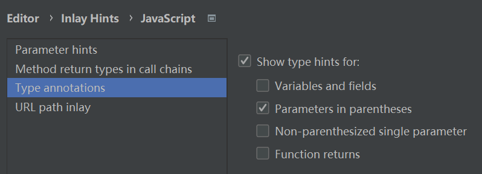

### 常用快捷键

多列光标同时输入：alt+鼠标左键键点击选择

展开收起代码块：ctrl+-  ctrl++

删除光标后面内容：ctrl+del

删除光标前面内容：ctrl+del

开启设置： ctrl+alt+s

打开粘贴板：ctrl+shift+v

上下滚动：ctrl+方向箭头

展示隐藏目录：alt+1

代码提示：ctrl+space


file => manage IDE setting 导入导出webstorm配置文件

因为与win快捷键冲突，自定义快捷键：

回到上个光标位置 ctrl+alt+pageUp

回到下个光标位置 ctrl+alt+pageDown

### 函数参数类型提示

如果误关闭了，可以这样打开 settings -> editor -> Inlay Hints -> javaScript -> Type annotations



### webStorm识别vue项目的配置路径

由于 Vue CLI 4 不再使用传统的 webpack 配置文件，故 WebStorm 无法识别alias别名，
需要在项目中添加一个文件让webstorm识别。文件名为alias.config.js

内容如下：
```js
/**
 * 由于 Vue CLI 4 不再使用传统的 webpack 配置文件，故 WebStorm 无法识别别名
 * 本文件对项目无任何作用，仅作为 WebStorm 识别别名用
 * 进入 WebStorm preferences -> Language & Framework -> JavaScript -> Webpack，选择这个文件即可
 * */
const resolve = dir => require('path').join(__dirname, dir)

module.exports = {
  resolve: {
    alias: {
      '@': resolve('src'),
      '@pack': resolve('packages')
    }
  }
}
```

```js
let a = 1
let b = 1
// 用//#region //#endregion手动添加折叠区域

//#region 
let c = 1
let d = 1
let e = 1
//#endregion
let f = 1
let g = 1
let h = 1
```

