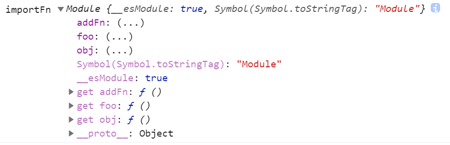

### require import

```js
// commentJs.js
var foo // = 'bar';
setTimeout(() => foo = 'baz change', 500);
console.log('模块内部执行了')
exports.module = foo
```

### require可以放在代码中，运行的时候才执行。如下，包在点击事件函数里，只有点击了才会打印'模块内部执行了'。

```js
function App() {
  return (
    <div onClick={()=>{let foo2 = require ('./commentJs');console.log('click')}}>click here</div>
  )
}
```

```js
const example = require('./commentJs.js'); // 写在这里，走到这里就执行，打印'模块内部执行了'

function App() {
  return (
    <div className="App">
          <div onClick={()=>{let foo2 = require ('./commentJs');console.log('click')}}>click here</div>
    </div>
  )
}
```

import只能放在代码最前面。

### CommonJS 模块输出的是一个值的拷贝，ES6 模块输出的是值的引用

### CommonJS 拷贝，普通的值传递或者引用传递，拷贝出的值不会因为后面模块的变化而变化
```js
// commentJs.js
let foo = 'bar';
setTimeout(() => foo = 'baz change', 500);
console.log('模块内部执行了')

module.exports = foo
```

### 因为是拷贝，如下两次foo2输出都是最开始的bar

```js
// app.js
let foo = require ('./commentJs。js')
console.log(foo); // bar
setTimeout(() => console.log(foo), 3000) // bar // 不是baz change
```

### 虽然拷贝的是值，如果是对现象，对象不会变，对象内的属性改变之后还是会跟着变化的。

```js
// commentJs.js
let foo = 'bar';
setTimeout(() => foo = 'baz change', 500);
console.log('模块内部执行了')
module.exports = foo
```

```js
// app.js
let foo2 = require ('./commentJs.js')
console.log(foo2.key); // bar
setTimeout(() => console.log(foo2.key), 3000) // baz change
```

### ES6 模块 引用，导入模块的属性或者方法是强绑定的，包括基础类型，值会因为后面模块的变化而变化

```js
// baseEs6.js
export var foo = 'baz';
setTimeout(() => foo = 'baz change', 500);
console.log('模块内部执行了')
```

因为是引用，如下两次foo值不一样。

```js
// app.js
import { foo } from './baseEs6';
console.log('同步代码执行')
console.log(foo) // baz
setTimeout(() => console.log(foo), 3000);// baz changed
```

打印结果：

模块内部执行了

同步代码执行

bar

baz change

### import 2 次同一模块，会共用该模块的变量

如何修改导出值

```js
// es6Module.js
export var foo = 1;
console.log('模块内部执行了')

export function addFn () {
  foo += 1
}

export var obj = { val: 1 };
```

```js
// app.js
import { foo as foo1 } from './es6Module.js';
import { foo as foo2 } from './es6Module.js';
import { obj as obj1 } from './es6Module.js';
import { addFn as add } from './es6Module.js';

console.log('foo1', foo1) // 1 // 这个foo1可以打印（右查询可以）
console.log('foo2', foo2) // 1 

// import生成的foo1 是只读引用
// foo1 = 3 // 想要赋值的时候会报错（左查询报错）。模块外部使用导出的变量时，不允许左查询，相当于无法直接修改导出变量 // ReferenceError: foo1 is not defined

// let foo1 = 3 // 会报已经定义过foo1的错，import已经把这个变量占了。 // Identifier 'foo1' has already been declared

obj1.val = 2 // 可以直接修改模块中抛出变量的属性
add() // 可以在模块外面，调用模块导出的方法修改模块导出的变量，直接修改变量是不行的
console.log('foo1', foo1) // 2

/**
 * 同一个脚本加载多次，或者不同的脚本加载这个模块，得到的都是同一个实例。所以模块中的变量是同一套
 */
console.log('foo2', foo2) // 2 两次引入会共享同一模块中的变量
console.log('obj1.val', obj1.val) // 2
```

### import() 结果是一个promise,promise结果是esModule(原生es模块)

异步原生esModule，可以放在判断语句中，不用放开头。

可以引用于条件加载（比如用户不同权限加载不同模块），或者按需加载（根据用户操作事件之后再按需加载模块）

与import * 导入的是一样的esModule。是===的。

```js
// es6Module.js
export var foo = 1;
console.log('模块内部执行了')

export function addFn () {
  foo += 1
}

export var obj = { val: 1 };
```

```js
// app.js
import * as esModule from "./baseEs6";

console.log('esModule', esModule) // 原生esModule

const getModule = async () => {
  const importFn = await import('./baseEs6.js')

  /**
   * import() 和 import * 导入的是一样的esModule。是===的。
   */
  console.log('esModule === importFn', esModule === importFn) // true ！！！

  console.log('importFn', importFn) // 原生esModule
  importFn.addFn()
  console.log(importFn.foo) // 2
}

const getModule2 = async () => {
  let importFn = await import('./baseEs6.js')
  console.log('importFn', importFn)

  console.log(importFn.foo) // 2 // 这里打印出的就是第一次引入的模块中的那个+1过的变量。重复引入模块时，模块内的变量是一套
}
getModule().then(getModule2()) // 第一次引入，异步完成后再次引入，保证第二次拿到的是第一次已经+1的importFn.foo
```

浏览器控制台打印出的原生esModule： ***（注意看Symbol(Symbol.toStringTag)属性和__esModule属性）***



commentJs 和 esModule 兼容及不兼容问题参考：

<a href="https://es6.ruanyifeng.com/#docs/module-loader#ES6-%E6%A8%A1%E5%9D%97%E4%B8%8E-CommonJS-%E6%A8%A1%E5%9D%97%E7%9A%84%E5%B7%AE%E5%BC%82">参考链接</a>


