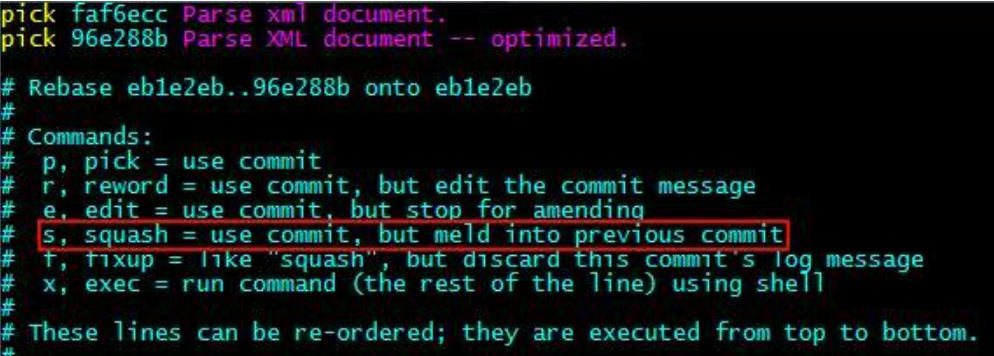
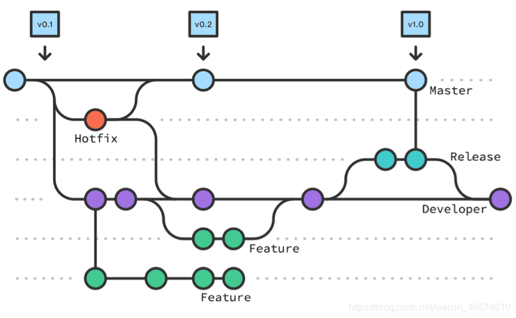

### 修改最后一次注释

```shell
git commit --amend
```

出现有注释的界面（你的注释应该显示在第一行）， 输入i进入修改模式，修改好注释后，按Esc键 退出编辑模式，输入:wq保存并退出。

修改倒数第二次的注释：

```shell
git rebase -i HEAD~2
```

最后的数字2指的是显示到倒数第几次 比如这个输入的2就会显示倒数的两次注释

想修改哪条注释，就把哪条注释前面的pick换成edit，注意顺序是按时间顺序的，倒数第二条在最后一条上面。保存。

```shell
git commit --amend
```

改完之后

```shell
git rebase --continue
```

修改上次提交的用户名和邮箱

```shell
git commit --amend --author="junx.zhang001 <junx.zhang001@ke.com>"
```

修改之前提交的用户名和邮箱，和改之前的注释一样，就是amend多加参数

```shell
git rebase -i HEAD~2
```

最后的数字2指的是显示到倒数第几次 比如这个输入的2就会显示倒数的两次注释

想修改哪条注释，就把哪条注释前面的pick换成edit，注意顺序是按时间顺序的，倒数第二条在最后一条上面。保存。

修改参数加上名字和邮箱

```shell
git commit --amend --author="junx.zhang001 <junx.zhang001@ke.com>"
```

改完之后

```shell
git rebase --continue
```

### 修改项目的用户名邮箱

命令方式：

```shell
git config --global user.name "AmosZhang"
git config --global user.email "moonyellow@126.com"
```

直接修改文件方式：

打开项目文件夹，进入隐藏文件夹git，编辑config文件。（这样能改变以后提交的用户名和邮箱，改之前的看上面）

```text
[user]
name = Amos Zhang
email = moonyellow@126.com
```

### 合并两次已push的commit

有时候需要把近几次的commit合并成一个，比如提交了一个修改，后来发现有问题，fix完了又提交一次，这时可能会想把这两次commit合并为一个。下面这个命令可以实现：

```shell
git rebase -i HEAD~2
```

敲完这个命令并回车后，会出现类似下图所示界面：




根据提示，把第二个“pick”改成“squash”，这样就可以把第二个commit合并到到第一个里，修改并保存后会出修改提交信息的界面。

这个界面会把两次commit的comments列出来，你可以任意修改成想要的注释，然后保存即可。

然后强制推到远端

```shell
git push -f
```

各种原因merges失败
You have not concluded your merge

撤回merge动作
```shell
git merge --abort
```

### lf crlf

设置系统换行符转换

Git中CRLF与LF的转换

1.换行符在不同的操作系统上的表示

首先要理解的一点是，对于不同的操作系统，对于换行符的表示是不一样的。也就是说当我们在编辑一个文件，在键盘上按下回车键的时候，对于不同的操作系统保存到文件中的换行符是不一样的。见下表：

CR:表示回车\r

LF:表示换行\n

CRLF:表示回车换行\r\n

敲下回车键，不同的操作系统保存到文件中的值：

Windows：使用的是CRLF ==> 即\r\n，文件中保存的是\r\n

Linux/Unix: 使用的是LF ==> 即\n，文件中保存的是\n

Mac OS: 使用的是CR ==> 即\r，文件中保存的是\r

Mac OS X系统：使用的是LF ==> 即\n，文件中保存的是\n（Mac OS X已经改成和Unix/Linx一样使用LF）

问题: 既然不同的操作系统，对于换行符使用不同的表示形式，如果一个团队在开发一个共同的项目，如果你使用的是windows系统，而你的小伙伴用的是Mac的话，当你们使用git协同开发软件时，就会出现换行符不统一的问题。

虽然对于不同的操作系统，默认的换行符的表示方法不一样，但是编辑器是可以设置在敲下回车键的时候保存的换行符是什么的，比如常用的vscode就可以进行设置。直接点击编辑器右下角的LF或者CRLF，出现如下图所示的设置，直接选择即可。在设置完成之后，在敲回车键，保存在文件中的换行符就是你设置的（CRLF或者是LF，设置什么就是什么）。

2.Git会自动对换行符进行转换

Git为了解决上面提出的问题，会自动对换行符进行转换。转换的方案有3种：

在提交时将CRLF转换为LF，在拉取（检出checkout）时将UNIX换行符（LF）替换成CRLF。（Windows系统推荐使用，我们在windows上安装git的时候，如果一路next，默认是使用这个方案）

在提交时将CRLF转换为LF，在拉取（检出checkout）时不进行转换。（Linux/Unix和Mac OS和Mac OS X推荐使用，在Unix或者类Unix操作系统上安装git，默认使用这种方案）

不进行转换（这种方案对于跨平台项目不推荐使用）。

可以发现，如果不使用第3种方案，那么在Git仓库（包括本地仓库和GitHub远程仓库）中保存的文件的换行符都是LF表示的。

3.自己指定换行符转换方案

我们自己在开发过程中，是可以修改/设置Git的换行符转换方案的。修改/设置的方法有2种。

3.1 通过Git的全局配置进行修改

设置autoclf属性，在控制台直接运行如下的一条命令就可以设置了：

// 提交时转换为LF，检出时转换为CRLF

git config --global core.autocrlf true

// 提交时转换为LF，检出时不转换

git config --global core.autocrlf input

// 提交检出均不转换

git config --global core.autocrlf false


## git-flow



- 建议从dev拉feature功能分支，进行开发，完成功能后往dev合，也可直接在dev分支上开发。已发布的功能分支建议超过1，2个月自己清理自己建的功能分支。
- 需要提测时，将dev分支合到测试用release分支
- 测试完成需要上线时，将release分支合到master分支，master分支作为发版分支
- 一般bug修复同一般开发流程
- 紧急bug热修，从master拉bugfix分支，修完自测后合到master发布，同时也需要合到dev分支