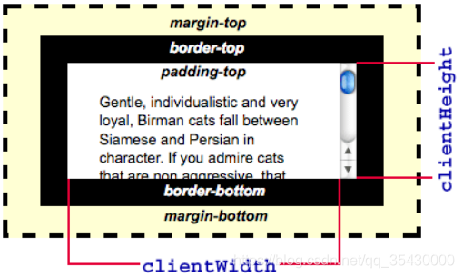
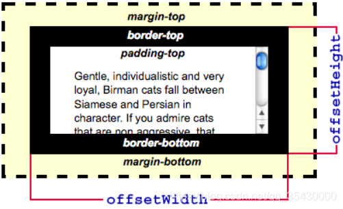
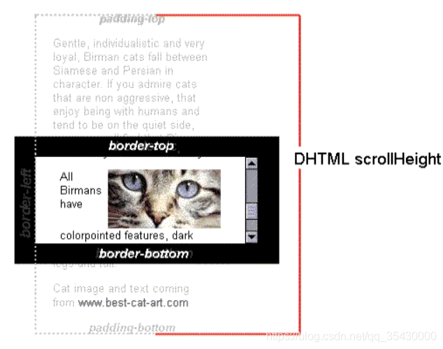
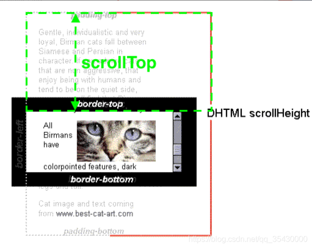

### 获取元素当前样式

```js
let style = window.getComputedStyle(element, [pseudoElt]);
```

element:用于获取计算样式的Element。 pseudoElt 可选:指定一个要匹配的伪元素的字符串。必须对普通元素省略（或null）。 返回的style（只读）是一个实时的 CSSStyleDeclaration
对象，当元素的样式更改时，它会自动更新本身。

### 拿到某dom所属的 #document

在 HTML 中，HTML 文档本身始终是元素的 ownerDocument。

可用于作为全局dom，用于添加全局事件。比如点击空白关闭某个小框

```js
document.getElementById("demo").ownerDocument
```

### clientHeight

视窗高度，包括padding，不包括border



### offsetHeight

高度，包括padding，包括border



### scrollHeight

视窗高度 + 视窗上方被滚出视窗的高度 + 视窗下方的高度



### scrollTop

整个文档顶部离视窗顶部的高度



1.ahook的infiniteScroll判断是否加载更多

scrollHeight下沿超出视窗下沿threshold高度就开始loadMore。

设置大，可以更提前地加载东西，确保更顺滑。

设置为-1，逻辑上会使整个计算式永远不成立，永远不执行loadMore

滚到底的时候scrollHeight = clientHeight + scrollTop，所以threshold<0时，条件永远不会成立。

2.如果元素容器target是在tabs内部，会出现display:none的情况。

ahook拿下面尺寸的时候都只能拿到0（没有类似先显示，拿到尺寸，再隐藏的特殊处理），

即，scrollHeight、clientHeight、scrollTop均为0，当threshold设置为大于等于0时，条件永远成立，第一次就会疯狂加载至底部。

如，设置为负值，等式永远不成立，永远无法loadMore。

故target有display:none的情况时，无法使用ahook里面的infiniteScroll

```js
if (el.scrollHeight - el.scrollTop <= el.clientHeight + threshold) {
  loadMore();
}
```
